# Data Lovers

# Datos Banco Mundial

## Índice

* [Preámbulo](#preámbulo)
* [Url Página web](#link)
* [Modo de uso](#modo-de-uso)
* [Historias de usuarios](#historias-de-usuarios)
* [Diseño de la Interfaz del usuario](#Consideraciones-para-el-diseño-de-la-interfaz-del-usuario)
* [Implementación de la Interfaz del usuario](#Implementación-de-la-Interfaz-del-usuario)
* [Consideraciones técnicas](#consideraciones-técnicas)
* [Planificación](#planificación)
* [Contenido de referencia](#contenido-de-referencia)
* [Resultado final](#resultado-final)

***

## Preámbulo

La demanda de datos estadísticos de buena calidad continúa aumentando. Las estadísticas oportunas y confiables son componentes clave de cualquier estrategia general de desarrollo. En este ámbito, mejorar la calidad y cantidad de los datos en todos los aspectos del desarrollo es fundamental para lograr el objetivo de un mundo sin pobreza.

Se necesitan datos de buena calidad para fijar niveles de referencia, identificar medidas públicas y privadas eficaces, determinar objetivos y metas, supervisar avances y evaluar efectos.

En el Banco Mundial, el [Grupo de gestión de datos sobre el desarrollo](https://datos.bancomundial.org/quienes-somos/contacto) coordina el trabajo estadístico y mantiene una serie de bases de datos sectoriales, macroeconómicas y financieras. Los equipos recurren a ellas para preparar Estrategias de asistencia a los países (EAP), estudios sobre pobreza, documentos de investigación y otros trabajos sectoriales y económicos. En estrecha colaboración con [las regiones](http://www.bancomundial.org/es/country) y sectores del Banco, el grupo se guía por estándares profesionales en la recopilación, compilación y difusión de la información para asegurar que todos los usuarios puedan confiar en la calidad e integridad del material producido.

Gran parte de la información proviene de los sistemas estadísticos de [los países miembros](http://www.bancomundial.org/es/about/leadership/members) y por consiguiente, la calidad de los datos mundiales depende del grado de precisión de dichos sistemas. 

No obstante, los datos por sí mismos son de poca utilidad. Para que esas grandes cantidades de datos se conviertan en información fácil de leer para los usuarios, necesitamos entender y procesar estos datos. Una manera simple de hacerlo es creando interfaces y visualizaciones. Y para esto hemos creado “nombredelapágina”.

## Esta página web es posible visualizarla en el siguiente link
url...

## Modo de uso
Este sitio ha sido diseñado para facilitar la búsqueda, la descarga y el uso de los datos específicos (demográficos, económicos y comerciales) del Banco Mundial.

### Barra de búsqueda y menú del sitio

 La manera más fácil de buscar datos es usando el cuadro de búsqueda en la parte superior de la página.
 
****

Usted puede buscar por indicadores, países y temas. En el cuadro de búsqueda, cuando escriba un texto podrá ver una lista de resultados coincidentes; simplemente, seleccione uno de los términos coincidentes para ver el resultado al instante. Tenga presente que puede visualizar sólo un indicador a la vez.

Para empezar de nuevo, cliquee en el ícono de "volver al inicio" ubicado en la esquina inferior derecha de su pantalla.

## Historias de usuarios

1. **Javiera** es una joven emprendedora que necesita información de diferentes países latinoamericanos para evaluar la posibilidad de expandir su negocio de calcetines. Y para realizar su estudio utiliza “Nombre de la página” para obtener datos y a través de la visualización de gráficos puede también tener una idea más clara de lo que busca.  
  
2. **Joaquín** es RRPP y en la ONG que trabaja necesita realizar un estudio comparativo de datos demográficos de algunos países sudamericanos para medir, entre otros, el índice de natalidad de los últimos años.  
  
3. **Rodrigo** está terminando sus estudios universitarios. Y piensa en la posibilidad de realizar un magíster en México. Para ello, ya tiene la información de algunas instituciones de su agrado, pero para tomar una decisión necesita información adicional como por ejemplo la cantidad de habitantes y la de edad de ellos para ver si es lo que más le acomoda para pasar la temporada que estará en ese país.  
  
4. **Eduardo** es un inversionista chileno a quien le gustaría participar en un proyecto en el extranjero, pero no muy lejos de Chile ya que su familia vive aquí. Entonces, está muy interesado en invertir su dinero en Perú, pero para estar seguro, decide utilizar “Nombre de la página” y obtener más información acerca del crecimiento económico de ese país.

## Consideraciones para el diseño de la interfaz del usuario

Esta página contiene un título que hace referencia a la utilización de datos del Banco Mundial.

Imagen de gran tamaño relacionada con un impacto social. 

Barra de búsqueda y menú del sitio. 

Y una vez creado este diseño simple se realiza el primer testeo.

#### Prototipo de baja fidelidad

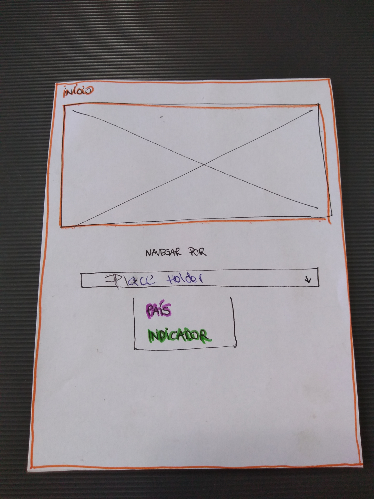 
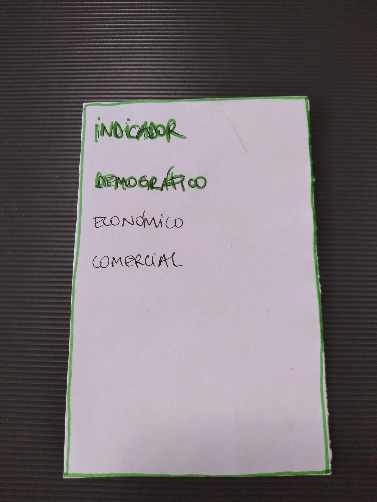 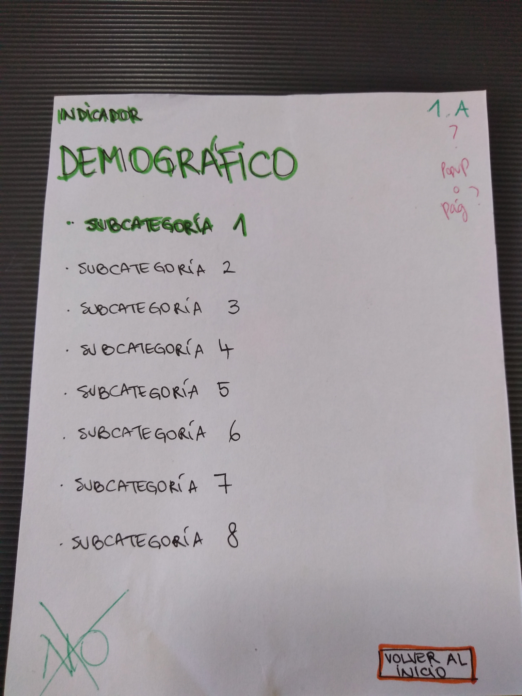 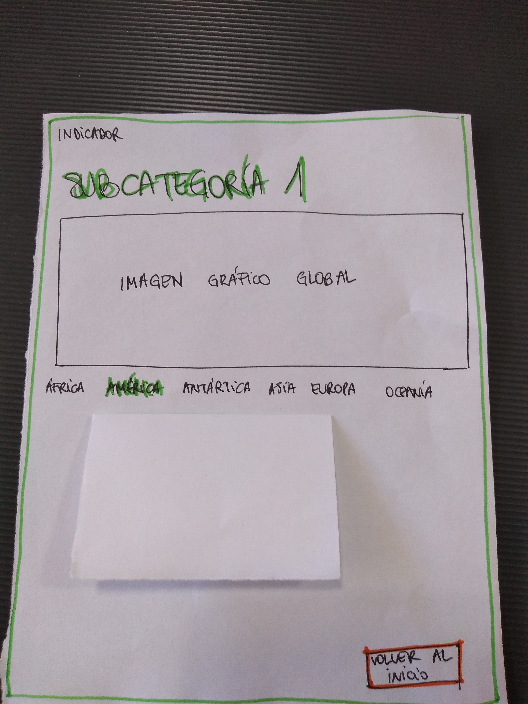 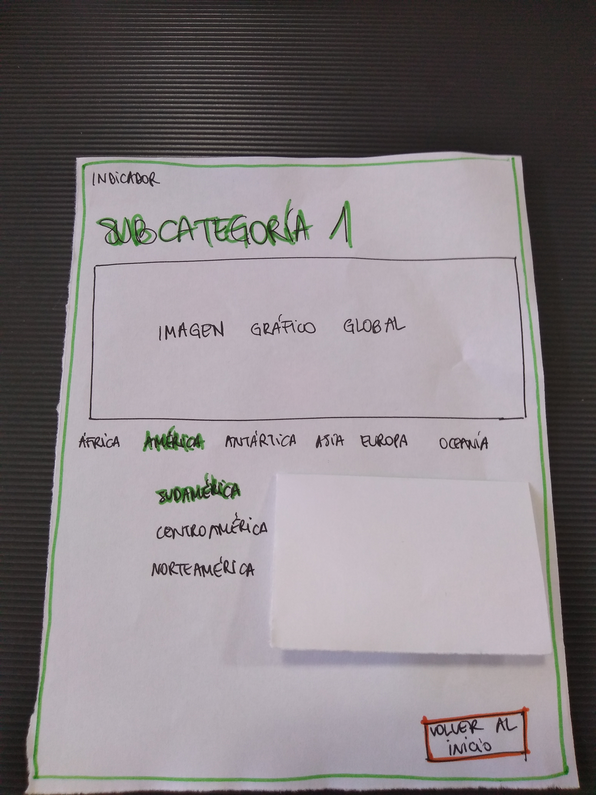 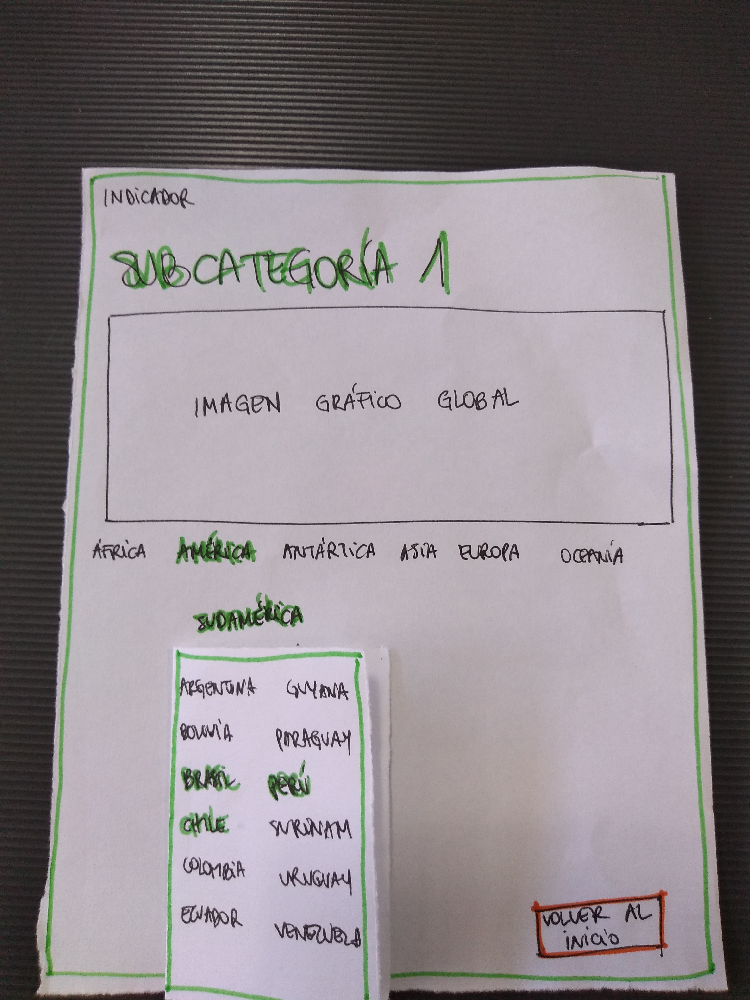 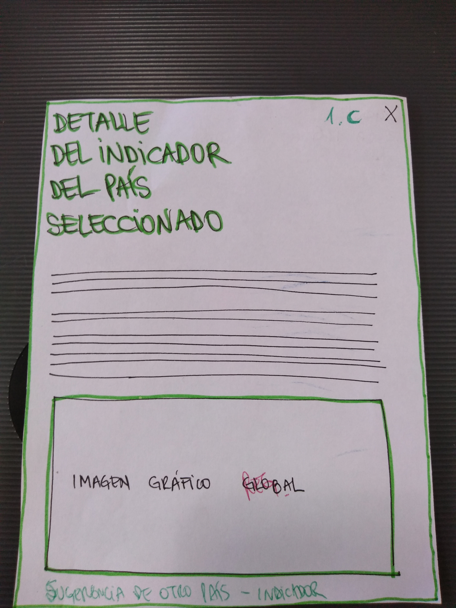 
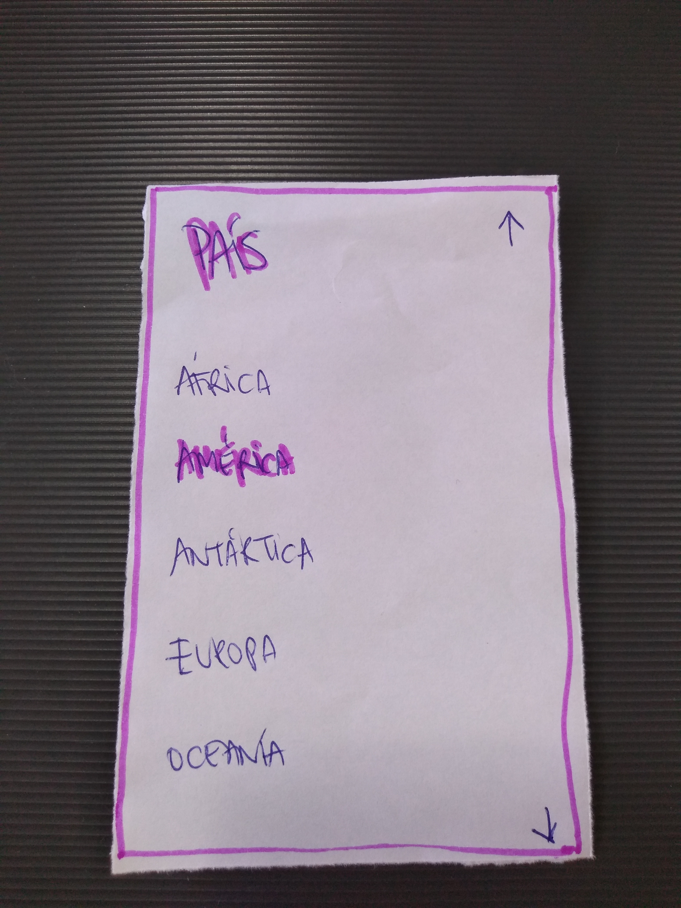 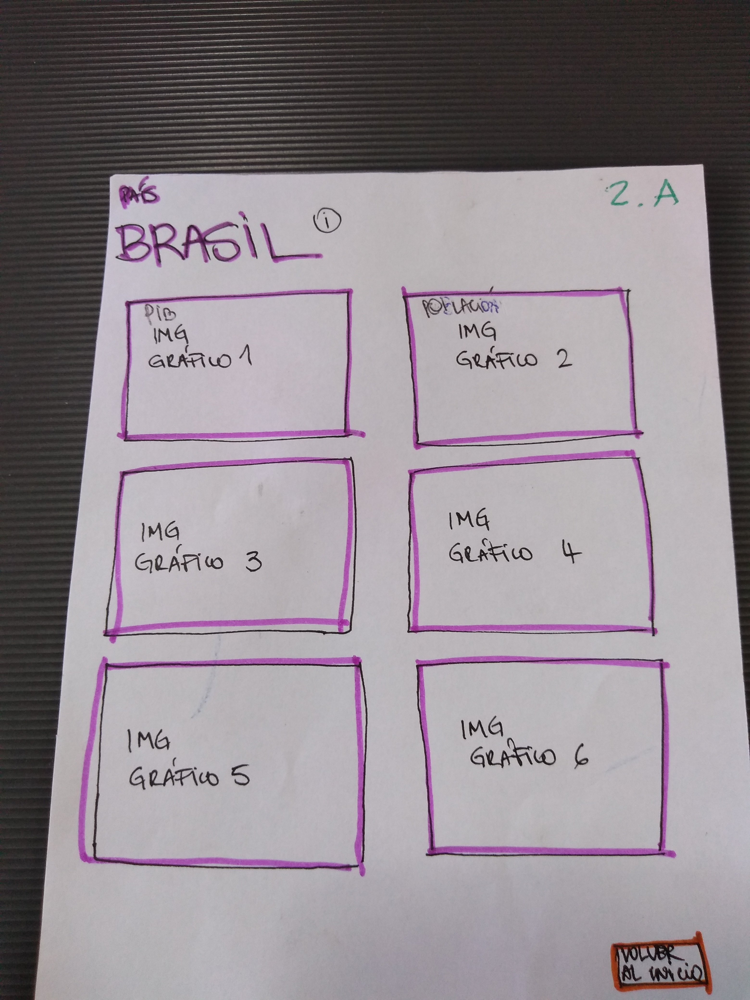 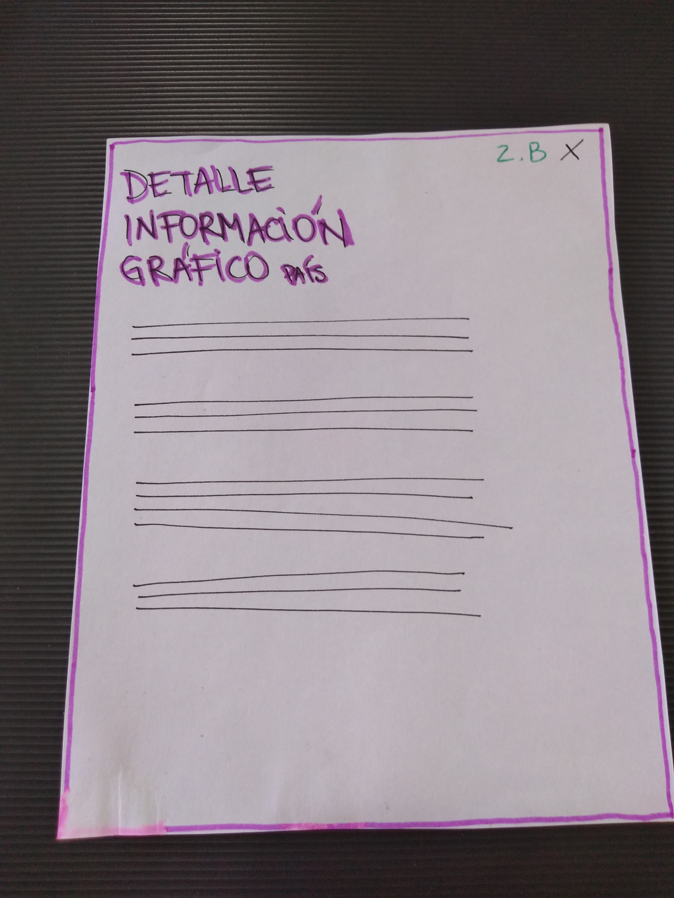

#### Testeos de usabilidad

Se realiza pruebas con seis usuarios, quienes prueban la página y:

Usuario1: Sugiere agregar la opción de ver más países/indicadores en la parte inferior del PopUp del detalle del indicador..

Usuario2: Sugiere agregar un pequeño enlace de noticias más relevantes de alguno de los indicadores mundiales. 

Usuario3: Sugiere utilizar los colores oficiales del Banco Mundial.

Todos los Usuarios: Sugieren mostrar un listado con todos los países en orden alfabético. En vez de seleccionar primero el continente, y luego el país.

Todos los usuarios: Sugieren agregar una breve introducción haciendo referencia a la utilización y autenticidad de datos en el mundo.

Entonces:

Procedemos a realizar las modificaciones correspondientes con las sugerencias de los usuarios testeados, y los cambios generados son los siguientes:

Agregando la introducción. 

Agregando los botones de PAÍS e INDICADOR. 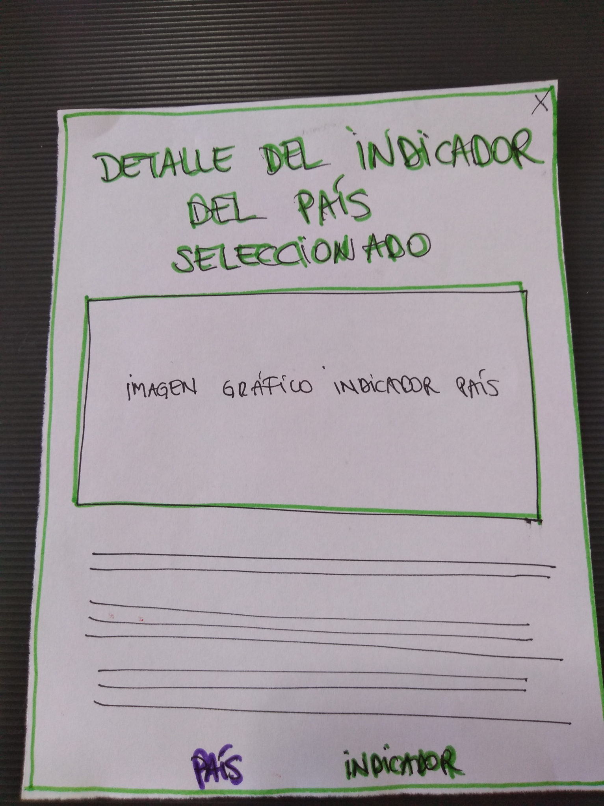

Agregando enlace de noticias. 

Mostrando un listado con todos los países en orden alfabético. 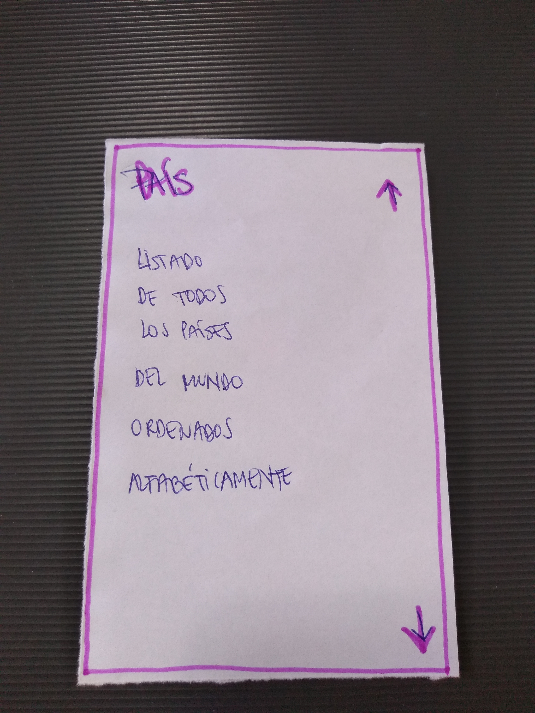

#### Prototipo de alta fidelidad

Y continuamos construyento la página web con una [identidad gráfica específica](https://doc-14-14-apps-viewer.googleusercontent.com/viewer/secure/pdf/98c22c4a6kspnc935i49f75rt483ki56/irr2aqjt6abgumc8vqsk3t2540mmj3jd/1545220950000/drive/07180011011210079559/ACFrOgD5NSTSuDk7VUxapfKMWBPo1Pg9h8mhpsMEGTBo06Mo4-JtA2sTaS5w0EXvTEUiXCaStN8hoKal-KR5ETGzzaKe1sSDX_S8hGBTnHRB7d51ezUZy7CTiwxUa14=?print=true&nonce=ljd2tpuaufhe4&user=07180011011210079559&hash=abgdd7bpalkgvqv33b31ak2nbo7r65f1) utilizada en la interfaz.

Es elegido el color **azul** que **simboliza lo fresco, lo transparente y tiene un efecto tranquilizador para la mente.** Representa la lealtad, la confianza, la sabiduría, la inteligencia, la fe, la verdad y el cielo eterno. Es adecuado para promocionar productos de alta tecnología o de alta precisión. Y también es el color utilizado en el sitio oficial del Banco Mundial.

[Figma](https://www.figma.com/)

Además, el diseño sigue los fundamentos de _visual design_. Y también, se exporta a [Zeplin](https://zeplin.io/) y utiliza las especificaciones de estilo que da Zeplin al momento de implementar los diseños en código.

## Implementación de la Interfaz de Usuario (HTML/CSS/JS)

1. Muestra la data en una interfaz: puede ser un card, una tabla, una lista, etc.
2. Permite al usuario filtrar y ordenar la data.
3. Calcula estadísticas de la colección (o subcolección) como media aritmética,
   máximo y/o mínimo de algún atributo numérico, o cuenta cuántas veces aparece
   un determinado valor, por ejemplo.
4. Se puede visualizar sin problemas desde distintos tamaños de pantallas: móviles,
   tablets y desktops.

## Consideraciones técnicas

La lógica del proyecto está implementada completamente en JavaScript(ES6), HTML y CSS.   

## Resúmen del código

El código creado en JavaScript(ES6) es una fórmula que permite visualizar la data, filtrarla, ordenarla, y realizar cálculos específicos como el promedio, el máximo y/o el mínimo, que permiten mostrar información aún más relevante a los usuarios.

## Pruebas unitarias

Pruebas unitarias para las funciones encargadas de _procesar_, _filtrar_ y _ordenar_ la data, así como _calcular_ estadísticas.

`src/data.js`:

* `filterData(data, condition)`: esta función `filter` o filtrar recibiría la
  data, y nos retornaría aquellos datos que sí cumplan con la condición.

* `sortData(data, sortBy, sortOrder)`: esta función `sort` u ordenar
  recibe tres parámetros.
  El primer parámetro, `data`, nos entrega los datos.
  El segundo parámetro, `sortBy`, nos dice con respecto a cuál de los campos de
  la data se quiere ordenar.
  El tercer parámetro, `sortOrder`, indica si se quiere ordenar de manera
  ascendente o descendente.

* `computeStats(data)`: la función `compute` o calcular, nos permitirá hacer
  cálculos estadísticos básicos para ser mostrados de acuerdo a la data
  proporcionada.

Estas son ideas de funciones que se pueden implementar, pero esto depende de la
propia implementación.

El archivo `src/data.js` tiene que tener una cobertura del 70% de _statements_
(_sentencias_), _functions_ (_funciones_), _lines_ (_líneas_), y _branches_
(_ramas_).

Estas funciones deben ser [_puras_](https://medium.com/laboratoria-developers/introducci%C3%B3n-a-la-programaci%C3%B3n-funcional-en-javascript-parte-2-funciones-puras-b99e08c2895d)
e independientes del DOM. Estas funciones serán después usadas desde el archivo
`src/main.js`, al cargar la página, y cada vez que el usuario interactúe (click,
filtrado, ordenado, ...).

## Test Realizado

## Planificación

Es posible ver la planificación del proyecto en el siguiente link:
(https://trello.com/b/NafHqb1L)

## Contenido de referencia

(http://www.bancomundial.org/)

## Resultado final

## Parte Opcional (Hacker edition)

Features/características extra sugeridas:

* En lugar de consumir la data estática brindada en este repositorio, puedes
  consumir la data de forma dinámica, cargando un archivo JSON por medio de
  `fetch`. La carpeta `src/data` contiene una versión `.js` y una `.json` de
  de cada set datos.
* Agregarle a tu interfaz de usuario implementada visualizaciones gráficas. Para
  ello te recomendamos explorar librerías de gráficas como [Chart.js](https://www.chartjs.org/)
  o [Google Charts](https://developers.google.com/chart/).
* 100% Coverage
